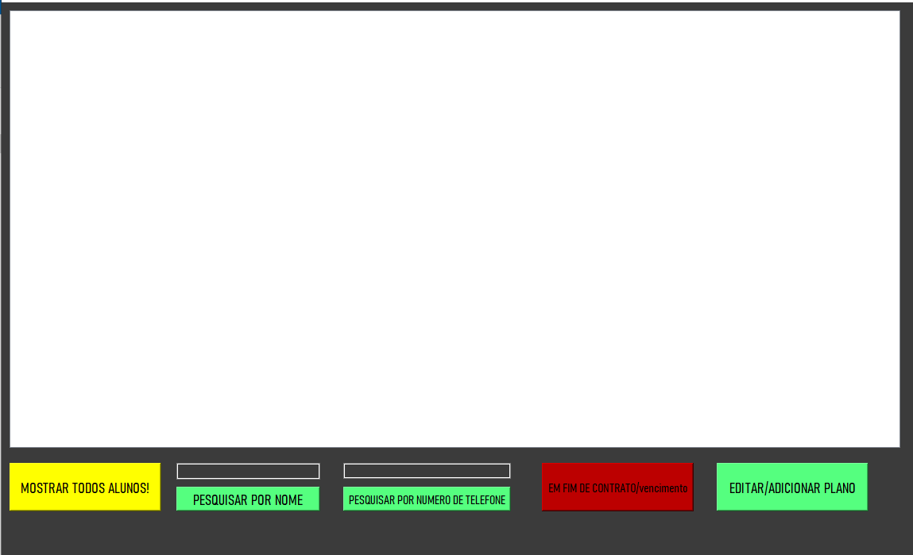

# SISTEMA DE CADASTRO ACADEMIA
Com meus estudos em Python, desenvolvi um breve, simples e pequeno sistema de uma academia feito em Python, PyQT5(qtdesign) e SQLite para a DB.
Sistema foi desenvolvido a fins didáticos, é o meu primeiro desenvolvimento usando SQLite, o proximo projeto será em MySQL.
Deixei os arquivos .ui no repositório, caso queiram utilizalos e modificalos no QT Design diretamente. Porém no código é utilizado somente os .py.

## Tecnologias usadas:
- Python
- PyQT5
- QT Design
- SQL (sqlite3 in python)
- DB Browser SQLite

# Neste sistema simples de academia, é possivel:
- Cadastrar o aluno(a), com data de nascimento, nome completo, endereço, numero de telefone e o tipo de plano desejado pelo cliente.
- Ver todos os aluno(a)s cadastrados no sistema da academia, sendo armazenados na database.
- Ver apenas os aluno(a)s que estão com o plano vencendo(10 DIAS para vencer).
- Pesquisar aluno(a) pelo nome.
- Pesquisar aluno(a) pelo numero de telefone.

## Tela de Login:

   

  
Neste caso somente administradores da academia(autorizados) podem fazer login no sistema, portando, o login disponiveis na Data Base (contas_admin.db) é: 
(usuario: admin   senha:123), PORÉM você pode adicionar mais usando o DB Browser ou algum editor de .db, não desenvolvi um cadastro para administradores da academia, 
pois achei desnecessário de inicio, podendo ser adicionado no DB Browser e passado ao estabelecimento depois.

## Tela pós login:

   

De inicio eu coloquei apenas 2 funções, uma para ver os clientes em geral e outra que é a que cadastra os clientes. Podendo ser adicionado mais coisas ao sistema futuramente.

## Tela de cadastro de aluno(a)s

   

Nesta parte, é onde é efetuado o cadastro do NOVO aluno no estabelecimento, tudo deve ser passado inclusive a data de inicio das atividades que será no dia da inscrição e o plano que o aluno irá adquirir.

## Tela de listagem dos alunos.

   

Aqui é a parte que possui toda a interação com os alunos JÁ CADASTRADOS! Onde o administrador poderá ver o dia em que vence o plano adquirido, pesquisar pelo nome, pesquisar pelo número de telefone e caso o aluno queira aumentar o seu plano(pagar a proxima mensalidade) pode-se utilizar a função de editar matricula.

## Tela de editagem/remoção do plano.

   

Nesta tela, será possível adicionar mais dias para o aluno na academia, sendo modificado a data de vencimento. Desta forma é possível também remover o aluno do sistema, caso ele não faça mais parte da academia.
